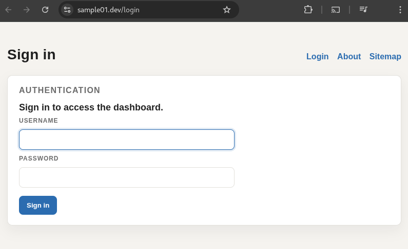
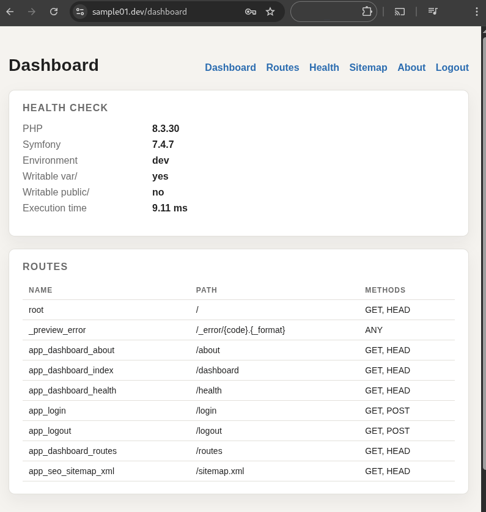

# Symfony Backend Technical Showcase

[](https://www.php.net/)
[](https://symfony.com/)
[](LICENSE)
[](https://github.com/YOUR_USERNAME/YOUR_REPOSITORY/actions)

The goal of this application is to illustrate pragmatic backend development practices rather than building a full product with :
- a clean development environment
- basic backend features
- automated code quality checks

## Features Demonstrated

- Dashboard (`/dashboard`) – overview page
- Route inspector (`/routes`) – lists application routes
- Health check (`/health`) – basic runtime diagnostics
- Login (`/login`) / logout (`/logout`) with Symfony Security form auth
- IP request rate limiter (e.g 5 requests / 30 seconds)
- SEO sitemap generator – CLI command generating `public/sitemap.xml`
- Symfony cache in route listing and IP request rate limiter

## Screenshots





## Technical Stack

- PHP 8
- Symfony (LTS)
- Doctrine DBAL
- SQLite (database file: `var/app.db`)
- Docker / Docker Compose

## Development tooling

- PHPStan (static analysis)
- PHP-CS-Fixer (code style)
- PHPUnit
- Git hooks (pre-commit / pre-push)
- GitHub Actions CI

## How to install

### 1. Follow the docker environment install [here](../../README.md)

### 2. composer install
Enter your web container from your host machine to install composer modules:

```bash
docker compose exec php /bin/bash
composer install
```

### 3. Create a dashboard user

```bash
php bin/console app:dashboard-user:create <username>
```

If `--password` is omitted, the command prompts for it.

### 4. Git hooks

Hooks are not installed automatically by Git. Use symlinks so updates to the hook files are picked up automatically.

From `[project-root]/.git/hooks`

```bash
ln -s ../../apps/web/.githooks/pre-commit pre-commit
ln -s ../../apps/web/.githooks/pre-push pre-push
```

If a hook already exists remove it.

Hook behavior:
- `pre-commit`: runs `composer cs:check` then `composer test`
- `pre-push`: runs `composer lint`

## Hooks from host machine

You can run Git from the host machine without installing Composer locally.

- If host `composer` exists, hooks run Composer commands directly in `apps/web`.
- If host `composer` is missing, hooks run Composer inside the `php` container via `docker compose exec`.
- If neither `composer` nor `docker` is available, hooks fail.

Requirement when using container mode: the `php` service must be running (`docker compose up -d`).

## Run tests

Run the full PHPUnit suite (including smoke test and any test files in `tests/`):

From host machine (containerized tooling):

```bash
docker compose -f ../../docker-compose.yml exec -T php composer --working-dir=/var/www/web test
```

## CI checks

GitHub Actions runs:
- `composer lint`
- `composer cs:check`
- `composer test`
